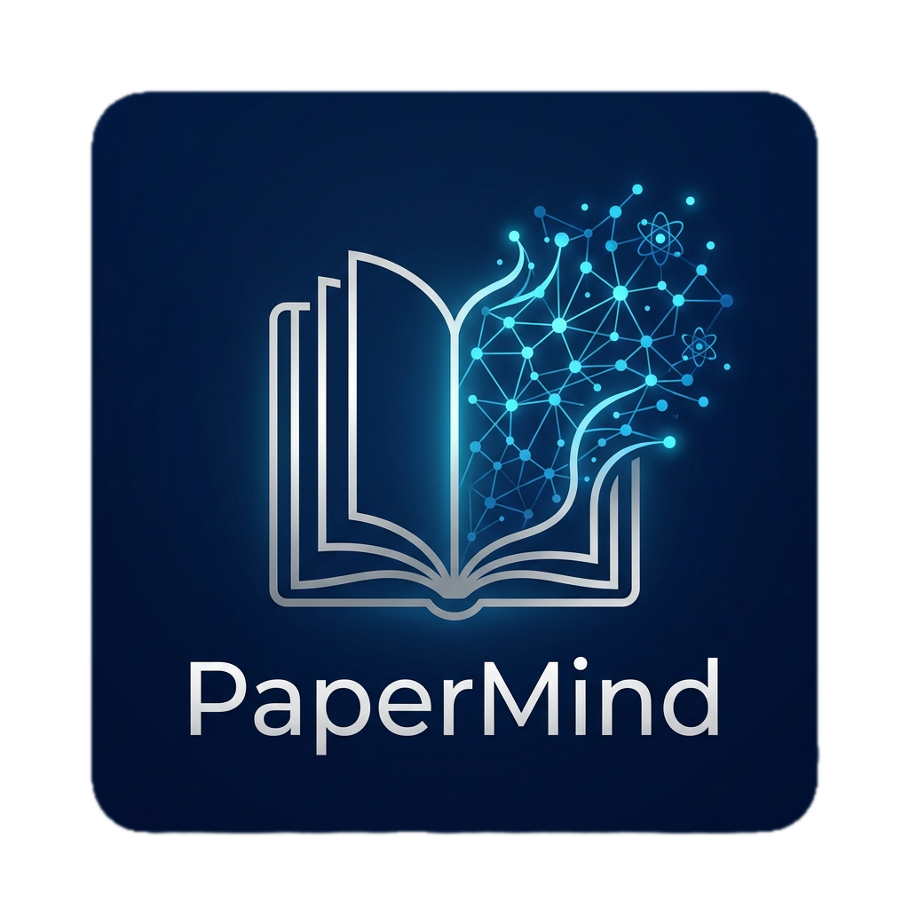

<div align="center">
  
  <h1>PaperMind</h1>
  <p>Automated Academic Knowledge Graph & PDF Digestion</p>
</div>

## Overview

**PaperMind** is an automated, background-first knowledge ingestion system built on top of the Open Notebook architecture. It is designed to automatically convert a standard folder of academic PDFs into a fully parsed, embedded, and interconnected knowledge graph of atomic concepts.

## Features

- 📂 **Folder Watcher**: Automatically detects when academic PDFs are added to designated local folders.
- 📥 **Automated Ingestion**: Computes hash checks to prevent duplicates and safely routes PDFs into the backend ingestion queue.
- 🧠 **Academic Parsing**: Extracts titles, abstracts, sections, and metadata from scientific papers (Integration in progress).
- ⚛️ **Atomic Concepts**: Breaks down dense research into granular `Atom` and `Concept` nodes stored natively in SurrealDB mapping.

## Getting Started

Make sure you have your `.env` configured properly and your virtual environment set up.

To run the complete system (API + Worker + Database + Frontend):

```bash
make start-all
```

To stop the system gracefully:

```bash
make stop-all
```

## Setup & Testing the Watcher

You can test the automated file watcher seamlessly from the CLI:

```bash
source .env
.venv/bin/python test_watcher.py
```
This will set up a test notebook, register a local `test_papers/` folder, and monitor it. Dropping a PDF into that folder will automatically trigger the ingestion pipeline.

## Architecture

PaperMind leverages:
- **FastAPI / Python (3.12)**: Core ingestion and API routing mechanics.
- **Watchdog**: Background daemon integrated directly into the FastAPI lifecycle for native file system event monitoring.
- **SurrealDB**: Advanced multi-model database persisting `WatchedFolder`, `AcademicPaper`, `Atom`, and `Concept` entities linked with standard notebooks.

## Acknowledgements & Credits

This project is built on top of and heavily borrows from the excellent **[Open Notebook](https://github.com/nutlope/open_notebook)** project. Full credit goes to the original authors for the foundational architecture, ingestion mechanics, and UI.

🤖 **Disclaimer**: This project is proudly **vibecoded (AI slop)**. Built entirely via AI coding assistants. Proceed with caution and expect whimsical architecture choices!
